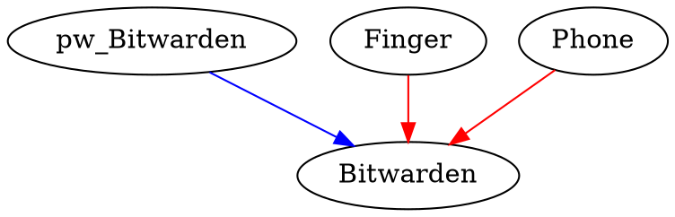

# DILMA? 
## Did I Lose My Account?

Urs Kahmann & Niklas Schröder

--- 

### Das Problem
- Hilfe mein Email Account wurde mir kompromittiert! 😬
 
- Ist mein Netflix Konto jetzt in Gefahr?

---

### Motivation
- Passwort und Account Jungel
	- Handy
	- Passwortmanager
	- OTP Apps
	- Name seines Haustiers
	- YubiKey   
	- Passwort für Festplattenverschlüsselung

- Habt ihr einen Überblick über die Abhängigkeiten?
  
---

### Lösung
- [User Account Access Graphs](https://people.inf.ethz.ch/rsasse/pub/AccountAccessGraphs-CCS19.pdf)  (ETH Zürich 2019)
- Modelierung der Abhängigkeiten als Graph

---

# Demo

---

### Architektur
- unabhängige Module
	- IO: CommandHandler
	- Geschäftslogik: AccountAccessGraph  
	- Visualisierung: [Graphviz](https://graphviz.org/)

![[Pasted image 20230709175643.png]]

---

### Interessante Implementierungsdetails
- `cabal` als Package Manager
- Graph Datenstruktur ==> `.dot` Datei  für Visualisierung  

---

# Fragen?

---

# FIN!

---